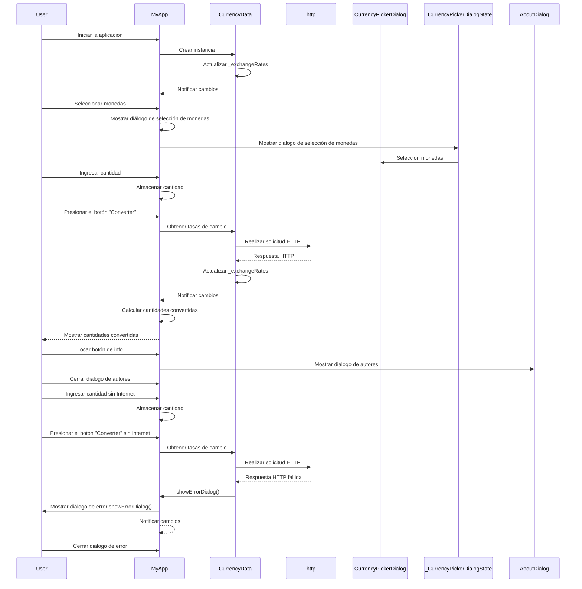

## Diseño software

```mermaid
sequenceDiagram
    participant User
    participant MyApp
    participant CurrencyData
    participant http
    participant CurrencyPickerDialog
    participant _CurrencyPickerDialogState
    participant AboutDialog
    User ->> MyApp: Iniciar la aplicación
    MyApp ->> CurrencyData: Crear instancia
    CurrencyData ->> CurrencyData: Actualizar _exchangeRates
    CurrencyData -->> MyApp: Notificar cambios
    User ->> MyApp: Seleccionar monedas
    MyApp ->> MyApp: Mostrar diálogo de selección de monedas
    MyApp ->> _CurrencyPickerDialogState: Mostrar diálogo de selección de monedas
    _CurrencyPickerDialogState ->> CurrencyPickerDialog: Selección monedas
    User ->> MyApp: Ingresar cantidad
    MyApp ->> MyApp: Almacenar cantidad
    User ->> MyApp: Presionar el botón "Converter"
    MyApp ->> CurrencyData: Obtener tasas de cambio
    CurrencyData ->> http: Realizar solicitud HTTP
    http -->> CurrencyData: Respuesta HTTP
    CurrencyData ->> CurrencyData: Actualizar _exchangeRates
    CurrencyData -->> MyApp: Notificar cambios
    MyApp ->> MyApp: Calcular cantidades convertidas
    MyApp -->> User: Mostrar cantidades convertidas
    User ->> MyApp: Tocar botón de info
    MyApp ->> AboutDialog: Mostrar diálogo de autores
    User ->> MyApp: Cerrar diálogo de autores
    User ->> MyApp: Ingresar cantidad sin Internet
    MyApp ->> MyApp: Almacenar cantidad 
    User ->> MyApp: Presionar el botón "Converter" sin Internet
    MyApp ->> CurrencyData: Obtener tasas de cambio
    CurrencyData ->> http: Realizar solicitud HTTP
    http -->> CurrencyData: Respuesta HTTP fallida
    CurrencyData ->> MyApp: showErrorDialog()
    MyApp ->> User: Mostrar diálogo de error showErrorDialog()
    MyApp -->> MyApp: Notificar cambios
    User ->> MyApp: Cerrar diálogo de error 
```

