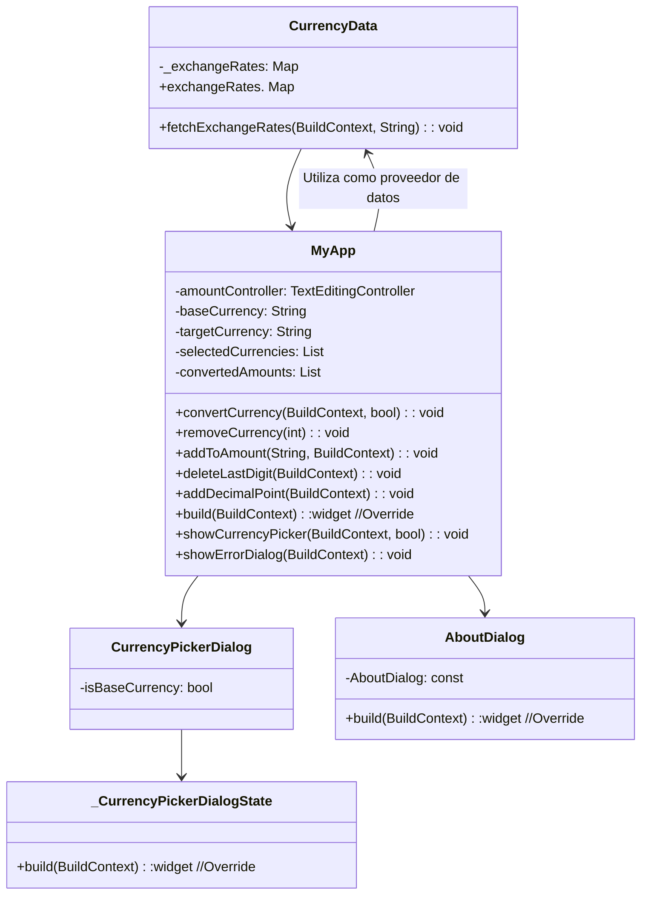

## Diseño software

```mermaid
classDiagram
  class CurrencyPickerDialog {
    -isBaseCurrency: bool
  }
  class _CurrencyPickerDialogState {
    +build(BuildContext):widget //Override
  }
  class CurrencyData{
    -_exchangeRates: Map<String, dynamic> 
    +exchangeRates. Map<String, dynamic> 
    +fetchExchangeRates(BuildContext, String): void
  }
  class MyApp {
    -amountController: TextEditingController
    -baseCurrency: String
    -targetCurrency: String
    -selectedCurrencies: List<String>
    -convertedAmounts: List<double>
    +convertCurrency(BuildContext, bool): void
    +removeCurrency(int): void
    +addToAmount(String, BuildContext): void
    +deleteLastDigit(BuildContext): void
    +addDecimalPoint(BuildContext): void
    +build(BuildContext):widget //Override
    +showCurrencyPicker(BuildContext, bool): void
    +showErrorDialog(BuildContext): void
  }
  class AboutDialog {
    -AboutDialog: const
    +build(BuildContext):widget //Override
  }
  MyApp-->CurrencyPickerDialog
  CurrencyPickerDialog-->_CurrencyPickerDialogState
  MyApp-->CurrencyData : Utiliza como proveedor de datos
  CurrencyData-->MyApp 
  MyApp-->AboutDialog
```
